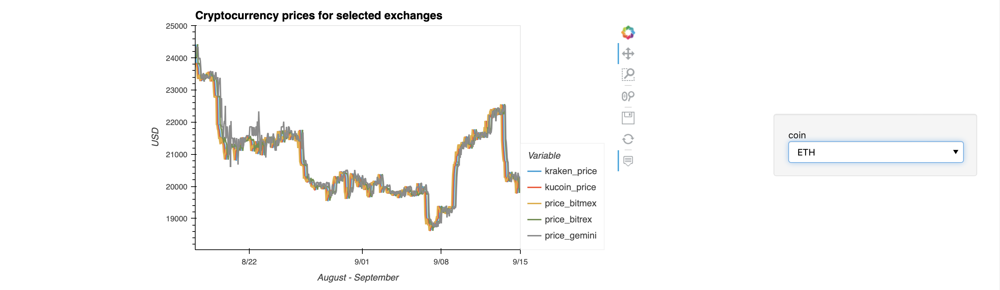
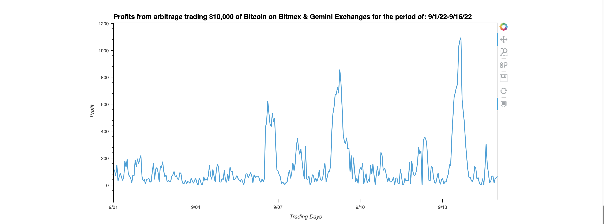

# *Crypto Arbitrage*

    Dream Team Members: Jim, Katerina, Simon
---

**Welcome to our repository for the crypto arbitrage. Please explore the codebase!** <br />
**See our Heroku app:** * https://cryptoarbitrage-dreamteam1.herokuapp.com.

---
## Analytical Summary

This project searches for a cryptocurrency arbitrage opportunity across selected exchanges:  Kucoin, Kraken, Bittrex, Bitmex, and Gemini and for the selected cryptocurrencies: Bitcoin, Ethereum, Solana, Polkadot. 

Research questions:

 - Are there viable cryptocurrency arbitrage opportunities across the studied exchanges?

 - Do these opportunities vary for different currency pairs and over time?

---

## Technologies

This project leverages python 3.7 with the following packages:

* [pandas](https://pandas.pydata.org) - Library for reading/writing csv files and fast manipulation with DataFrames.

* [numpy](https://numpy.org) - Library for fast manipulation of n-dimensional arrays.

* [datetime](https://github.com/python/cpython/blob/3.10/Lib/datetime.py) - Library for manipulating time and dates.

* [requests](https://pypi.org/project/requests/) - HTTP library.

* [hvplot.pandas](https://hvplot.holoviz.org) - A tool that is built on Holoviews, used for plotting data.

* [krakenex](https://github.com/veox/python3-krakenex) - Library for scraping Kraken.com exchange.

* [python-kucoin](https://python-kucoin.readthedocs.io/en/latest/) - Library for scraping Kucoin exchange.

* [voila](https://voila.readthedocs.io/en/stable/) - Library for creating web applications.
---

## Installation Guide

Before running the application first install the following dependencies.

```python
  pip install pandas
  pip install numpy
  pip install DateTime
  pip install requests
  pip install hvplot
  pip install krakenex
  pip install python-kucoin
  pip install voila

```
---

## Usage

To use this project simply clone the repository and run the code **crypto_arbitrage.ipynb** in JupyterLab or in VS Code.
For the web application run **voila crypto_arbitrage.ipynb** after commenting out the Scraping part of the script.

---

## Methodology
We use statistical inference and visualizations to reveal patterns in data.
First, we provide the script with a function to scrape the prices for the selected cryptocurrencies from the exchanges: Kraken, Kucoin, Bitmex, Bittrex and Gemini.
The summary statistics is as follows:


The below graph visualizes the price dynamics for the currencies:


Further analysis reveals the biggest arbitrage opportunities for the currency Polkadot across the exchanges Bitmex and Gemini.
Graphical representation of the price differences is below:


The following graphs displays a potential profit from the arbitrage in the month of September 2022:


For comparison, the code provides similar calculations and visualizations if the arbitrage targeted the currency Bitcoin:



---

## License

MIT

---


 
